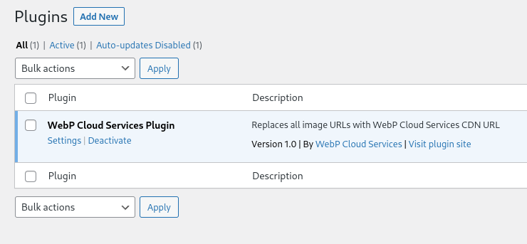
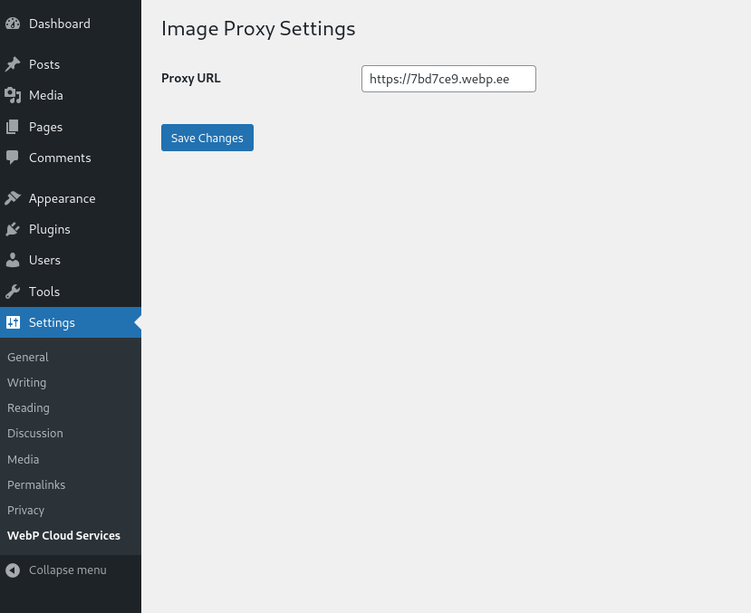

# WebP Cloud Wordpress plugin

The Wordpress plugin for WebP Cloud(https://webp.se).

## Usage

### Create a proxy on [WebP Cloud Dashboard](https://dashboard.webp.se/proxy)

After creation, you'll find your "Proxy Address". 

In the example here, it's `https://7bd7ce9.webp.ee`.

### Download plugin and upload to Wordpress
> If you have SSH access to your server, you can clone this repository to `wp-content/plugins` which will make upgrade more easier.

You can download the zipped plugin at: https://github.com/webp-sh/wordpress-plugin-webp-cloud/archive/refs/heads/master.zip

Now, upload to wordpress using "Upload" on Plugins page, and activate it

### Configure Plugin

In the plugin's settings page, fillin the "Proxy Address" from above:

After clicking "Save Changes", your site is using WebP Cloud for serving images!

## Demo site

We've maintained a demo site at https://wordpress.webp.se/fk7-running-shanghai-tianma/ , you can take a look here.

